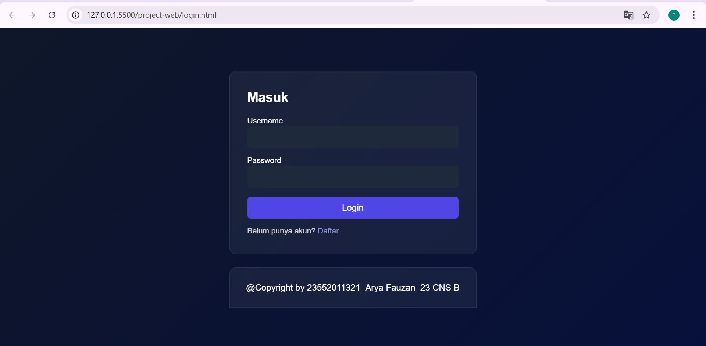
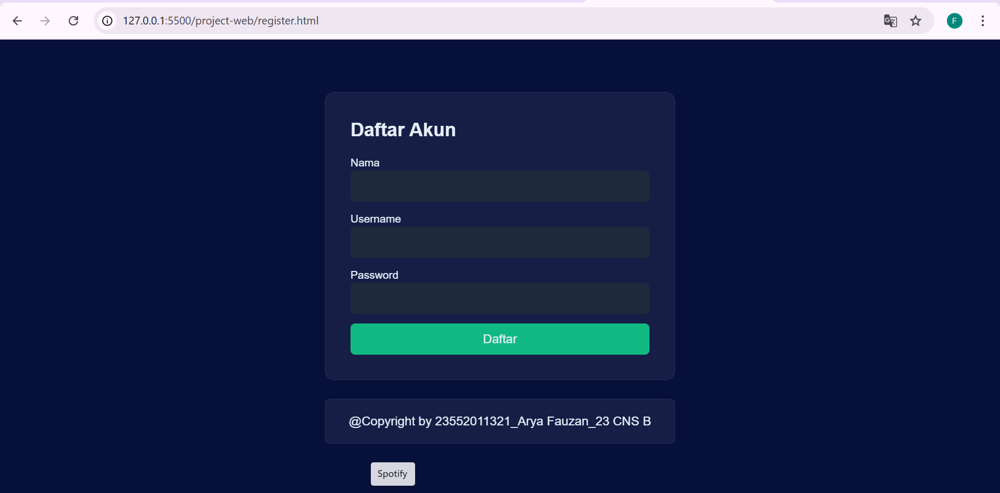
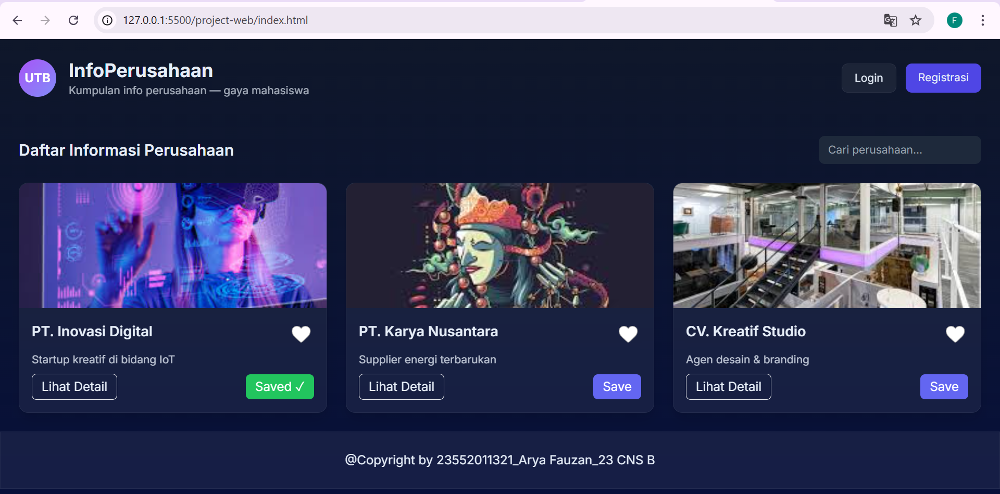
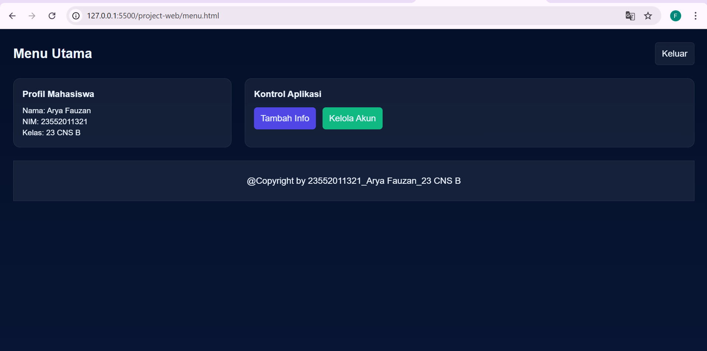
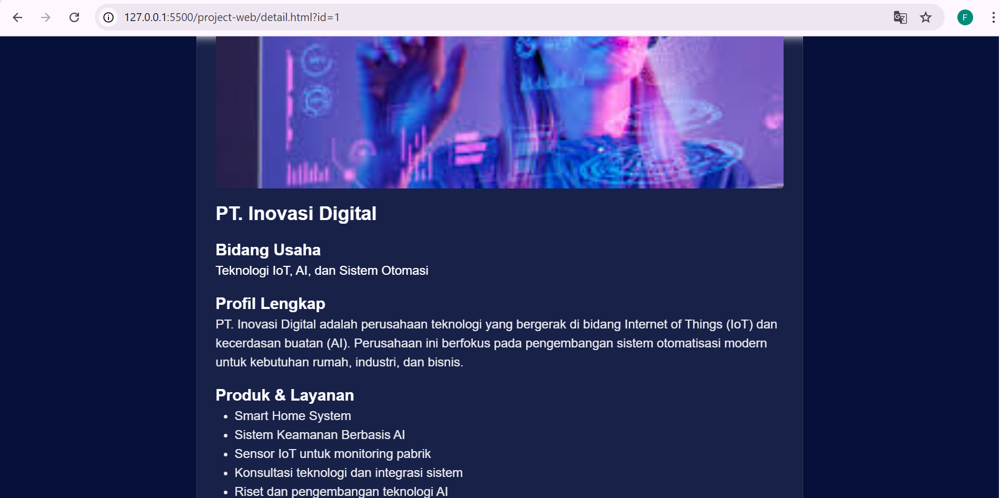
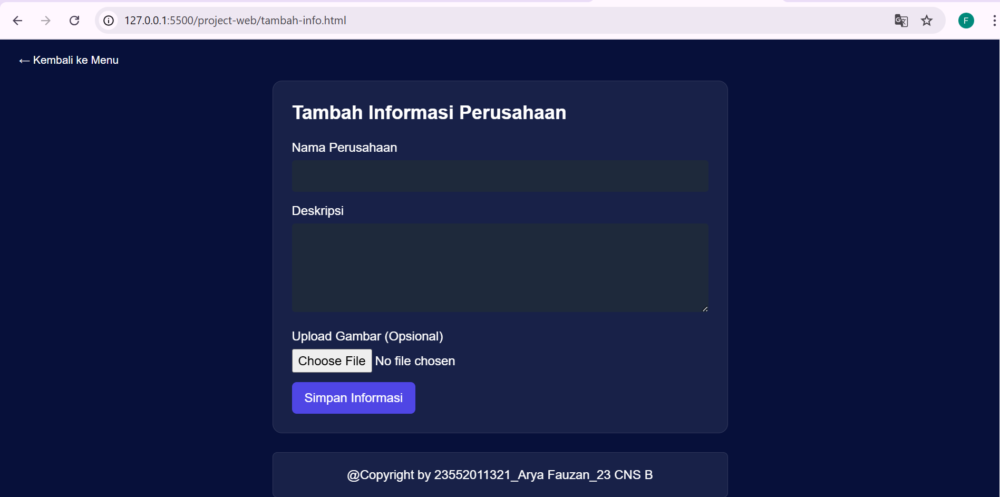
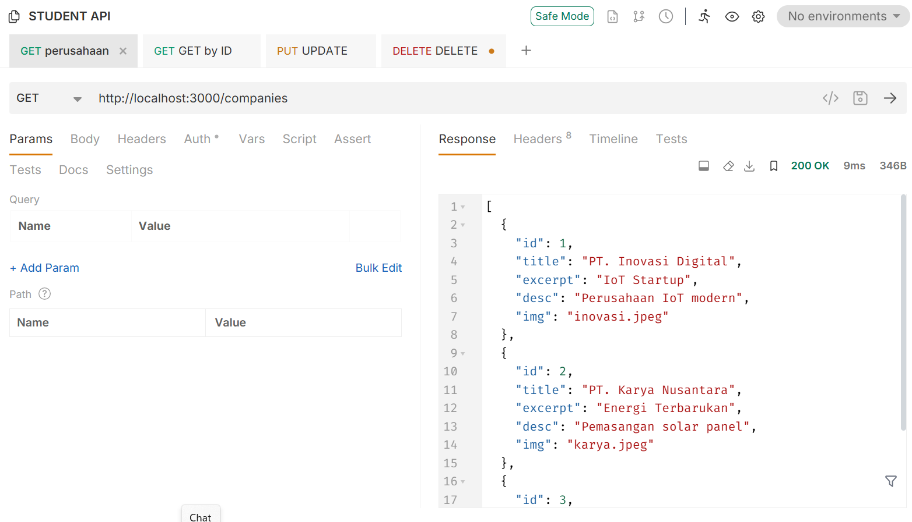
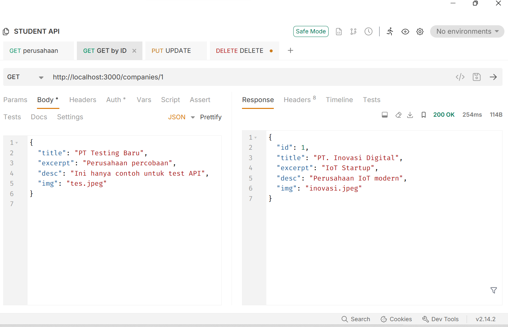
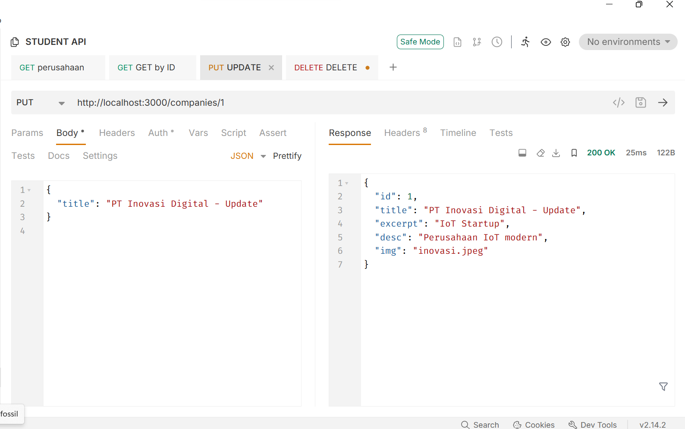
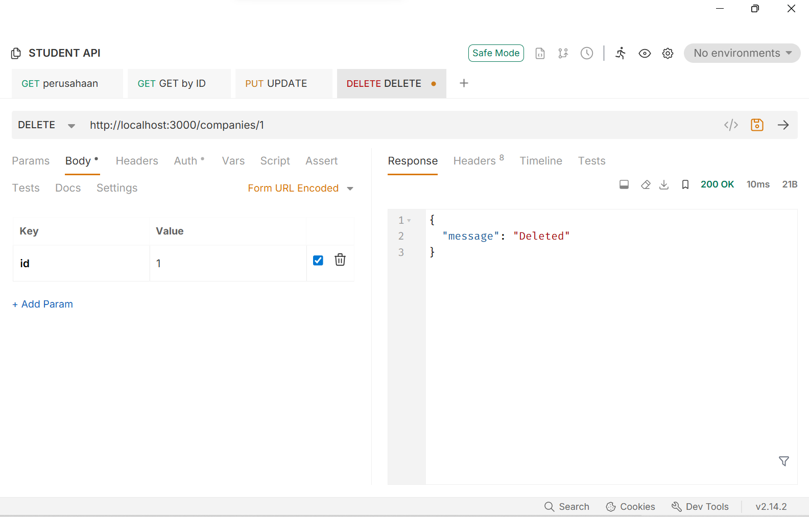

# 🖥️ **Student Voice (Project Ujian)**

**Student Voice** adalah aplikasi web sederhana untuk manajemen konten dan interaksi mahasiswa.  
Dibuat menggunakan **HTML, CSS, JavaScript**, dan data sementara disimpan di **JSON / localStorage**.

---

# ✔ **Fitur Website**

## 1. Halaman Publik (index.html / profil.html)
- Tampilan modern dan responsif  
- Visi, Misi, Tentang Kami  
- Lowongan terbaru (Preview)  
- User belum login hanya bisa melihat detail  

## 2. Halaman Login
- Validasi form menggunakan JavaScript  
- Jika login berhasil → masuk ke `menu.html`  
- Jika gagal → menampilkan alert error  

## 3. Halaman Register
- Validasi form lengkap  
- Setelah berhasil → redirect ke login  

## 4. Menu Utama (menu.html)
- Hanya bisa diakses setelah login (`sessionStorage`)  
- Search lowongan  
- Filter kategori  
- Tombol logout  
- Akses ke riwayat lamaran  

## 5. Detail Lowongan
- Mengambil data dari JSON / API GET  
- Bisa Apply (harus login)  

## 6. Apply Lowongan
- Form lengkap: Nama, Email, HP, CV, Alasan  
- Notifikasi sukses (Toast)  
- Data tersimpan di localStorage  
- Redirect ke **Lamaran Saya**  

## 7. Riwayat Lamaran (lamaran-saya.html)
- Menampilkan semua lamaran yang pernah dikirim  
- Bisa Hapus Satu atau Semua  
- Data tersimpan di localStorage  

## 8. Sistem Login
- Login disimpan menggunakan sessionStorage  
- Logout menghapus session  
- Menu hanya bisa dibuka jika user sudah login  

---

# ▶️ **Cara Menjalankan Project**

1. Letakkan folder `student-voice` di dalam `htdocs` (jika menggunakan XAMPP).  
2. Jalankan server Apache.  
3. Buka browser dan akses:  
http://localhost/student-voice/project-web/index.html

---

## 🔐 Akun Login Ujian

Gunakan akun ujian:  
Username : admin
Password : 123

---

## 🖼️ Tampilan Web
### login

### register

### index

### menu

### info

### detail

### kelola

PRAKTIK 2 API

## Perusahaan

http://localhost:3000/companies

## ID

http://localhost:3000/companies/1

## UPDATE 

http://localhost:3000/companies/1

## DELETE

http://localhost:3000/companies/1

